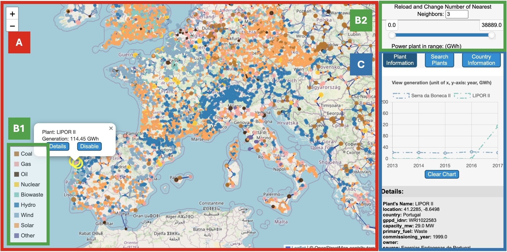

# EnergyViz: Mapping the Pulse of Our Power

## Overview
EnergyViz is an interactive visualization tool that explores power plants around the world. It helps users understand where electricity comes from, how it is produced, and how energy systems differ across regions.

## targeted audience:
**Primary – Public**  
We turn "background energy support" into active exploratory tool to inspire personal environmental stewardship.
**Secondary – Researchers**  
We provide a creative model for experts to bridge the gap between complex data and public understanding.

## Communication Goal: 
Exploration and comparison to help visitors understand the scale of different energy types and capacity.

## Data Source
This project is based on the public dataset:  
https://datasets.wri.org/datasets/global-power-plant-database

It builds on previous work presented in:
- Poster: https://doi.org/10.2312/evp.20241095  
- Paper: https://doi.org/10.1145/3769534.3769541

## Tool Overview

### (A) Power Plant visualization 
The central view displays power plants as nodes in a network.

- Node size represents **generation** (larger nodes = higher generation)
- Edges connect nearby plants, showing **geographic proximity**
- Edge thickness reflects distance (closer plants = thicker edges)

Users can:
- Click nodes to view plant details
- Click edges to see distance between plants
- Zoom and pan to explore different regions

Selecting a plant highlights it and displays detailed information in the panel.

### (B) Filtering and Settings Control 

Control panels allow users to customize the visualization:

- Adjust number of neighboring connections  
- Filter plants by generation (range slider)  
- Select energy sources (fuel types in legend)  

These filters help users explore patterns and focus on specific subsets of the data.

### (C) Detail and Further Control 

This panel provides deeper insights through three tabs:

#### Plant Information
- Displays detailed attributes:
  - Name, location, country  
  - Capacity and generation  
  - Fuel type and commissioning year  
- Includes a line chart showing generation over time  
- Highlights selected plants on the map  

#### Search Plants
- Search power plants by name  
- Results are filtered based on current settings  
- Clicking a result centers the map and shows details  

#### Country Information
- Displays total generation per country  
- Allows sorting and comparison  
- Users can select countries to explore their plants  

## Future Improvements

- Add timeline filtering (filter the power plants by their commissioning year)  
- Provide country-level summaries (total capacity, generation, or number of plants)  for each country

